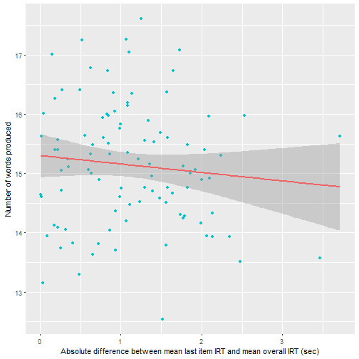

## Introduction

This is the manual for the optimal foraging app you are using right now. It is designed to give you a clear indication of what to expect for the app and what to give the app as input. Also, I will discuss what the app returns as results. 

## The task tab

In this tab, one can do its own variant of a creativity task used by [Hills, Jones & Todd (2012)](https://pdfs.semanticscholar.org/8857/9afc83b90c1530b16f9396eca8eb55757c7e.pdf). The app then keeps track of your responses and returns a couple of visualizations of the search process. 

1. In the upper left corner there is a plot which indicates the similarity of the submitted word with the previous word (hence, the first word will not be plotted). The color of the bars depends on the switching between patches by the participant, where a red color indicates a patch switch and a blue color a patch stay. An example of such a plot is displayed below. 

2. In the upper right corner, the similarity of the submitted word with the previous five words is displayed. This plot only shows up when you have submitted more than 5 responses to the app. An example of this plot is displayed below.

3. Below, a reaction time plot is displayed, showing the reaction time throughout the 60 seconds where the user submits words to the app. It can be seen as a line, which drops to zero when an answer is submitted. This allows you to link the patch switches to the reaction time, as the user can see when the reaction time is higher and lower. The reaction time is displayed in blue, while the mean of the reaction time is displayed in red and updated throughout the task. An example of this plot is displayed below.

## The file tab

In this tab, the user can upload a data file of the results of a similar experiment. The data file needs to meet strict requirements for the app to deal with the data. These requirements are shown in tab 2, but are also listed below. 

* Column 1 [sid]:           ID of participant"
* Column 2 [entry]:         Response of participant
* Column 3 [irt]:           Reaction time of participant
* Column 4 [fpatchnum]:     Patch number of word
* Column 5 [fpatchitem]:    Number of words in the patch
* Column 6 [fitemsfromend]: From items from end
* Column 7 [flastitem]:     Number removed from last item
* Column 8 [meanirt]:       Mean reaction time of participant
* Column 9 [catitem]:       Category of the word

An example data file is provided and can be downloaded by clicking the link [example file](https://www.dropbox.com/s/37is6uf3jrhx2g0/testdata.csv?dl=0). The dataset can be one of three formats, .csv, .txt or .xlsx. Other file formats are not accepted by the app. 

When the file is uploaded, the app automatically analyses the data and displays three plots.

1. The upper right corner displays the mean similarit of all the words with the previous five words. Error bars are added to display standard errors of the mean.  

2. The upper left corner displays the mean residual proximity for the words relative to the patch swith. The residual proximity is computed as the mean similarity to all possible remaining (not yet produced) words in the overarching category in the BEAGLE semantic space (Hills, Jones & Todd, 2012). Error bars are standard errors of the mean.

3. The last plot displays the difference between the reaction time of the last item and the mean reaction time as a funcion of the number of words produced. The red line is the linear regression line in and the grey surrounding it is representative for the standard error. 

## The theory tab

This page describe the theory underlying the Optimal Foraging Theory. It is based on the article by Hills, Jones & Todd (2012) and shows you the formula's associated with the Optimal Foraging theory and reveals how this theory relates to the animal kingdom, specifically the foraging behaviour of bees. 

## Github

The code for this app can be found on my [Github](https://github.com/koenderks/OptimalForaging) page.
